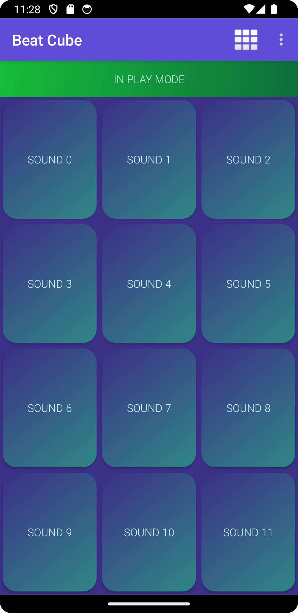
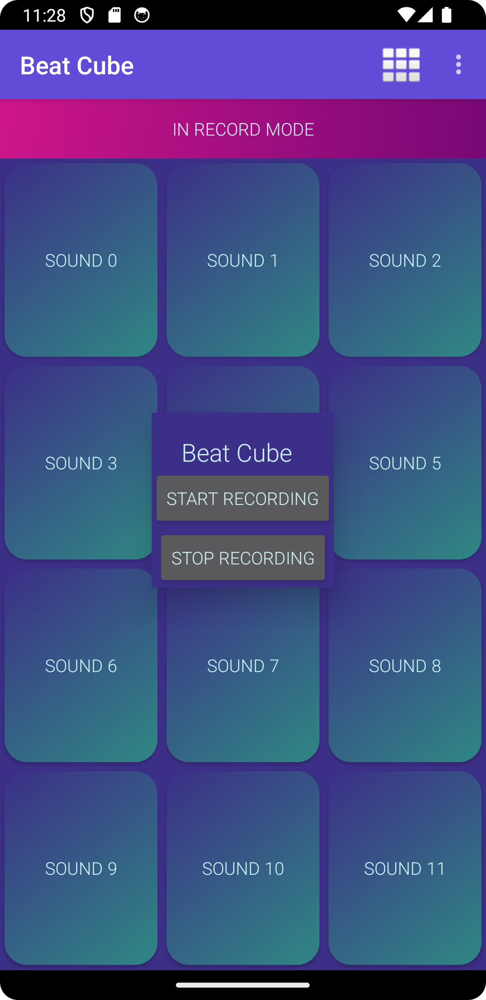

# BeatCube

BeatCube is an Android live music making application for beat boxers and finger drummers. Quickly and easily record your own drum sounds (or any sound you want) and assign them to a grid of beautiful buttons, then tap the buttons to make a sick beat, or use it to make a hillarious sound-board or ambient soundscape. You can even customize the number of buttons to your liking and it will keep the sounds you've already recorded assigned to the same number button regardless of grid size. It also incorporates a modern vaporwave aesthetic with smooth gradients and cool tones for a relaxing vibe, take a look!

<table>
    <tr>
        <td align="center">
            
        </td>
        <td align="center">
            
        </td>
    </tr>
</table>

## Components
BeatCube uses Android's activity-centered architecture as well as some other classes to provide shared functionality across all of the different activities

### MainActivity
This is the main activity where you record or play the sounds by tapping on the buttons. It uses a robust generateGrid method to dynamically generate the button object grid. This allows the users to customize the button grid to whatever number they want. It overrides the onGlobalLayout method using getViewTreeObserver in order to wait until the UI layout was rendered then calculate and set what the button width and heights should be so they are perfectly sized and evenly-spaced to fill the screen just so. This activity also initializes everything needed in the onCreate method.

### Recorder Class
This is the backbone of the application, it's a non-activity utility class that provides functionality for recording and playing audio. I implemented the audio using very low-level classes AudioRecord and AudioTrack. Instead of using common compressed audio files like mp3 files, I implemented buffered file streams of raw PCM audio data. I store the raw PCM audio data in a hash map which is stored in memory so it can be very quickly retrieved and played back for low latency. I also created methods like createWavFile which takes the raw audio stream and generates a permanent WAV file from scratch by writing the header of the file, then using a file stream to write the audio to it. There's also the reverse functionality of loadWavIntoHashMap that takes the permanent WAV files and loads them into the hash map in memory, which allows the app to get all the audio from the file system and get it ready for quick playback.

### ChangeGridSize
This is the activity where the user changes the button grid size by entering the number of rows and columns they want. It uses a custom theme that makes the activity ac as a dialog or pop up window.

### RecordActivity
The RecordActivity simply provides the UI and implementation for recording the audio samples

### Utils Class
This is a non-activity class to hold commonly used utility functions